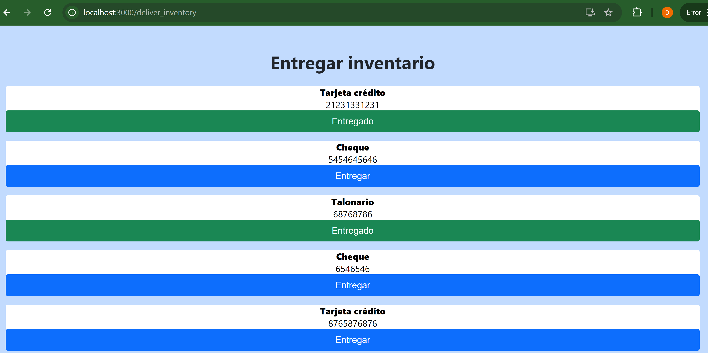

# inventario

## DjangoServer 
Back del proyecto

### Tecnologías Utilizadas

- **Django**: Framework web para crear APIs RESTful.
- **Django REST Framework**: Extensión para facilitar la creación de APIs REST.
- **mongoengine**: Para la integración de Django con MongoDB.
- **mysql-connector-python**: Conector para la base de datos MySQL.
- **python-decouple**: Manejo de variables de entorno.
- **Django CORS Headers**: Para permitir peticiones CORS desde el frontend.

### Requisitos

- Python 3.9 o superior

## inventory_product_front
Front del proyecto

### Tecnologías Utilizadas

- **React**: Biblioteca para construir interfaces de usuario.
- **Axios**: Cliente HTTP para hacer solicitudes a la API.
- **React Router DOM**: Para manejar la navegación entre vistas.

## Requisitos

- Node.js y npm

## Variables de Entorno Back
.env

```
DJANGO_SECRET_KEY=
DJANGO_DEBUG=
DJANGO_ALLOWED_HOSTS=
DJANGO_DB_NAME=
DJANGO_DB_USER=
DJANGO_DB_PASSWORD=
DJANGO_DB_HOST=
DJANGO_DB_PORT=
MONGO_DB_NAME=
MONGO_DB_HOST=
MONGO_DB_PORT=
```

### Ejemplos Endpoints del Backend

Tipos de productos

```
curl --location 'http://127.0.0.1:8000/api2/product-types'
```

Actualización inventario

```
curl --location --request PATCH 'http://127.0.0.1:8000/api/inventory-product/66e3f924ef6f2a129161bdf0' \
--header 'Content-Type: application/json' \
--data '{
    "product_type": 2,
    "serial_number": 1000,
    "shipping_status": true
}'
```

Consulta inventario

```
curl --location 'http://127.0.0.1:8000/api/inventory-product'
```

Creación inventario

```
curl --location 'http://127.0.0.1:8000/api/inventory-product' \
--header 'Content-Type: application/json' \
--data '{
    "product_type": 2,
    "serial_number": 1000,
    "shipping_status": false
}'
```

### Interfaz de Usuario




